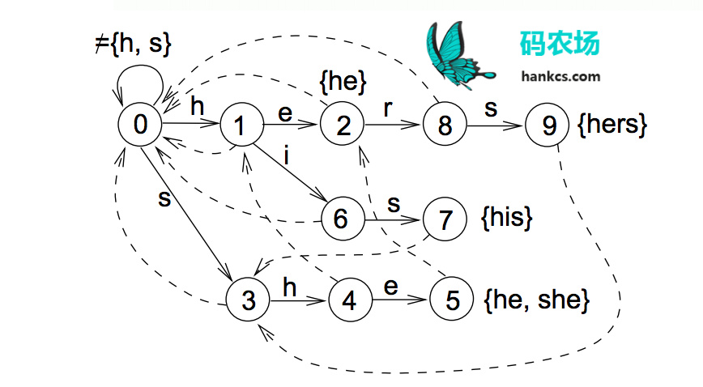

# python aho_corasick 

### 完整AC自动机图

### AC自动机创建流程
1. 构建Trie树 `__insert_node`
2. 建立失败路径 `__create_fail_path`
3. 搜索树 `search`

# 其他语言实现AC自动机
1. [Java版 AC](https://github.com/hankcs/aho-corasick)
2. [C++版 AC](https://github.com/cjgdev/aho_corasick)

# 相关文献
1. [Python Demo](http://algo.pw/algo/64/python)
2. [多模式匹配算法](https://www.cnblogs.com/xudong-bupt/p/3433506.html)
3. [码农场DoubleArrayTrie](http://www.hankcs.com/program/algorithm/aho-corasick-double-array-trie.html)